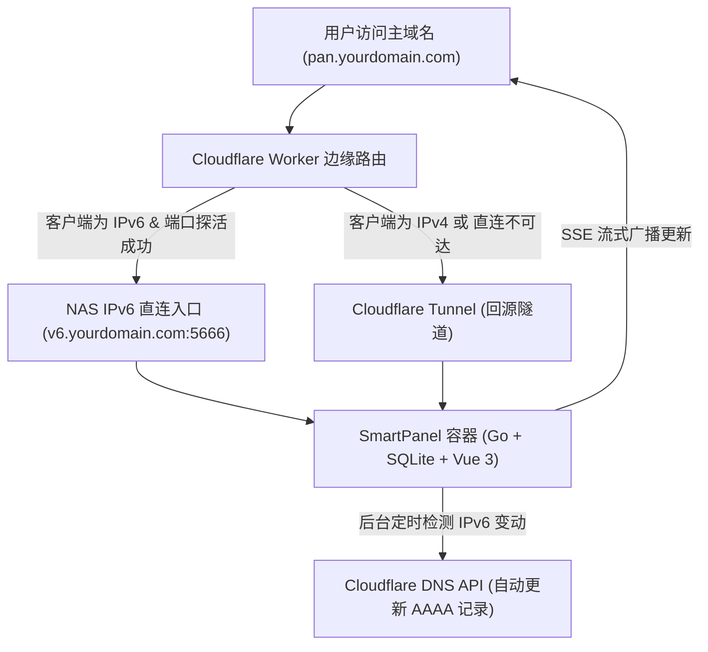

# SmartPanel - NAS 智能双栈导航面板

<p align="center">
  
</p>

<p align="center">
  <b>解决 NAS 用户“服务入口分散、内外网切换繁琐、界面不可定制”的终极解决方案</b>
</p>

<p align="center">
  
  
  
  
  
</p>

---

## 🌟 核心价值与特色

1. **智能内外网分流（核心）**：
   - 用户始终访问同一个入口主域名（如 `pan.yourdomain.com`）。
   - **Cloudflare Worker** 入口读取客户端 IP：检测到 IPv6 时自动 302 重定向至 NAS IPv6 直连域名（如 `v6.yourdomain.com:5666`），跑满千兆上行宽带；
   - IPv4 客户端或探测直连不可达时，自动无缝回退走 **Cloudflare Tunnel**，确保随时随地可达。
   - **前端双栈探针**：250ms 快速探测 IPv6，自动动态切换 API 基地址，结果保存在 `sessionStorage` 避免卡顿。
2. **动态 IPv6 管理与书签模板化**：
   - 解决家庭宽带公网 IPv6 前缀频繁变动问题。
   - 书签 URL 原生支持 `{ipv6}`、`{domain}`、`{v6domain}` 动态模板变量（如 `https://[{ipv6}]:5666/dashboard`）。
   - 后端定时（默认 5 分钟 + 启动即查）获取公网 IPv6，严格过滤 `2000::/3` 全局单播地址，检测到变动自动更新 Cloudflare AAAA DNS 记录，并通过 **SSE (Server-Sent Events)** 毫秒级广播推送到前端。
   - Cloudflare API Token 采用 **AES-256-GCM** 工业级加密存储于数据库。
3. **极致轻量与高兼容**：
   - 纯 Go 驱动 SQLite（`modernc.org/sqlite`，彻底脱离 CGO）。
   - 单二进制运行，容器镜像仅 ~50MB，空载运行内存低于 40MB，CPU 接近 0%。
   - 支持 `linux/amd64` 与 `linux/arm64`（群晖、威联通、极空间、绿联、飞牛 fnOS、树莓派等均可稳定运行）。
4. **高度可定制的外观系统**：
   - 4 种卡片质感风格：玻璃拟态 (Glassmorphism)、纯色实体、轻透磨砂、极简悬浮。
   - 自由调节圆角 (0-24px)、阴影、图标尺寸与栅格列数（手机 2 列、平板 3 列、桌面 4-8 列自定义）。
   - 本地壁纸上传、多图轮播、高斯模糊调节、遮罩透明度调节、Unsplash 网络随机壁纸。
   - 字体预设选择与自定义字体文件上传（TTF/WOFF2）。
   - 全局自定义 CSS 动态注入与自定义 JS 安全执行。
5. **系统监控与服务健康检测**：
   - 原生采集宿主机 CPU 利用率、物理内存与磁盘使用率。
   - 挂载 `/var/run/docker.sock:ro`，实时监控容器清单、运行状态与健康度。
   - 书签支持独立健康检测，卡片实时亮起绿/红健康指示灯与毫秒级延迟。
6. **多引擎全局搜索与全键盘导航**：
   - 支持 Bing、Google、百度及自定义搜索引擎一键切换。
   - 快捷键 `/` 或 `Ctrl+K` 快速聚焦搜索，支持方向键卡片选择与回车直达。
7. **数据安全与全量灾备**：
   - 一键将 SQLite 数据库与上传的图标/壁纸打包成 ZIP 下载。
   - 支持上传 ZIP 灾难恢复还原。
   - 兼容浏览器 Netscape HTML 书签与 JSON 配置导入导出。

---

## 🏗️ 架构流转原理



---

## 🚀 极速部署指南 (Docker Compose)

### 1. 准备 `docker-compose.yml`

创建目录并保存以下配置：

```yaml
services:
  smartpanel:
    image: ghcr.io/surce555/smartpanel:latest
    container_name: smartpanel
    restart: unless-stopped
    ports:
      - "5666:5666"
    volumes:
      - ./data:/app/data
      - ./uploads:/app/uploads
      - /var/run/docker.sock:/var/run/docker.sock:ro
    environment:
      - TZ=Asia/Shanghai
      - PANEL_PORT=5666
      - JWT_SECRET=your-random-jwt-secret-string
      - ENCRYPTION_KEY=your-32-byte-aes-encryption-key!
```

> **参数说明**：
> - `ENCRYPTION_KEY`：用于在本地数据库中高强度加密 Cloudflare API Token 的密钥。
> - `/var/run/docker.sock`：只读挂载 Docker 套接字，用于在控制台展示容器状态。

### 2. 启动容器

```bash
docker compose up -d
```

### 3. 初始登录与安全设置

- 打开浏览器访问：`http://<NAS_IP>:5666`
- 点击右上角登录，默认管理员账号：
  - **账号**：`admin` (或 `admin@smartpanel.local`)
  - **初始密码**：`admin123`
- *安全提示：首次登录后系统会强制要求修改密码。登录后可进入「安全与账户」页面：*
  - **自定义管理员账号**：支持自由修改为任意易记账号名称（如 `admin`、`nas` 或个人邮箱）。
  - **私密访问模式**：支持开启「强制登录后才显示导航页」，开启后未登录访客访问首页将自动跳转至登录页，完全保护书签隐私。

> **💡 NAS IPv6 与 Docker 网络模式提示**：
> 部分 NAS 系统的 Docker 默认桥接网络（bridge）未配置 IPv6 转发，可能导致容器内无法发起 IPv6 外网探测请求。
> - **强烈推荐**：在 `docker-compose.yml` 中开启 `network_mode: host`（并注释掉 ports 映射段），使容器直接使用 NAS 宿主机网络栈，完美直通 IPv6。
> - **智能识别**：SmartPanel 支持多层 IPv6 探针（国内节点 `6.ipw.cn`、网卡扫描及客户端访问回填），在「网络与 DDNS」页面中可实时看到当前检测记录并支持一键应用或手动指定。

---

## 🌐 智能双栈内外网分流配置

### 步骤 1：配置 IPv6 直连域名与 HTTPS 证书

1. **DNS 解析**：
   - 在 Cloudflare 为你的 IPv6 直连子域名（例如 `v6.yourdomain.com`）添加一条 **AAAA** 记录，指向 NAS 当前公网 IPv6 地址。
   - **关键设置**：必须关闭小黄云代理（设置为 **仅 DNS (DNS only)**）。
2. **签发 SSL 证书**：
   - 由于直连域名端口（5666）由浏览器发起访问，若主站为 HTTPS 则必须确保直连域名也是 HTTPS（避免 Mixed Content 拦截）。
   - 在 NAS 上使用 `acme.sh` 或 `Caddy` 为 `v6.yourdomain.com` 申请免费证书（推荐 DNS-01 验证方式），并配置反向代理指向本地 5666 端口。

### 步骤 2：部署 Cloudflare Worker 入口脚本

1. 登录 Cloudflare 控制台，进入 **Workers & Pages** -> **Create application** -> **Create Worker**。
2. 将本项目根目录下的 `cloudflare-worker/worker.js` 代码完整复制粘贴到 Worker 编辑器中。
3. 在 Worker 设置中的 **Variables** 添加环境变量：
   - `V6_TARGET`：设置为你的直连域名与端口，例如 `v6.yourdomain.com:5666`
   - `ENABLE_PROBE`：`true`
4. 将 Worker 绑定路由到你的主域名（例如 `pan.yourdomain.com/*`）。

### 步骤 3：在 SmartPanel 后台配置自动 DDNS

1. 登录 SmartPanel -> 进入 **管理面板** -> **网络与 DDNS**。
2. 填入：
   - **主域名**：`pan.yourdomain.com`
   - **IPv6 直连域名**：`v6.yourdomain.com`
   - **Cloudflare API Token**：拥有 `DNS:Edit` 权限的 Token
   - **Zone ID** 与 **Record ID**（对应 `v6` 子域名的 AAAA 记录）
3. 开启 **Cloudflare 自动 DDNS 同步** 开关，点击保存。
4. 随后后端每 5 分钟自动检测公网 IPv6 变动并静默同步！

---

## 🇨🇳 国内 NAS 环境 GHCR 镜像拉取加速

若 NAS 在国内网络环境拉取 `ghcr.io` 镜像速度较慢，可选用以下任一加速方式：

### 方案 A：使用第三方 GHCR 加速代理
在拉取镜像前加上代理前缀：
```bash
docker pull docker.m.daocloud.io/ghcr.io/surce555/smartpanel:latest
# 或
docker pull ghcr.nju.edu.cn/surce555/smartpanel:latest
```
拉取完成后打上本地标签：
```bash
docker tag docker.m.daocloud.io/ghcr.io/surce555/smartpanel:latest ghcr.io/surce555/smartpanel:latest
```

### 方案 B：配置 Docker Daemon 镜像源
修改 `/etc/docker/daemon.json`：
```json
{
  "registry-mirrors": [
    "https://dockerproxy.cn",
    "https://mirror.baidubce.com"
  ]
}
```
保存后重启 Docker 服务：`sudo systemctl restart docker`。

---

## 🛠️ 本地开发与代码构建

### 前端开发
```bash
cd frontend
pnpm install
pnpm run dev
```

### 后端开发
```bash
cd backend
go run main.go
```

### 本地全量容器构建
```bash
docker build -t smartpanel:latest .
```

---

## 📄 开源许可

本项目基于 [MIT License](LICENSE) 协议开源。
